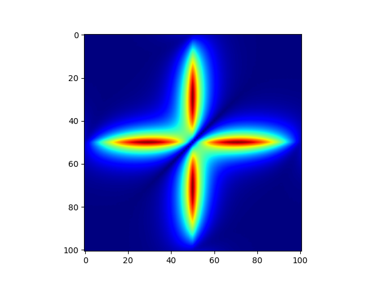

# fermions.jl

Energies of 1D fermions with 3-body contact interactions, As well as 2D with 2-body interactions. Finds excited states as well as scattering state energies.

## Dependencies

The LTS version of julia is required.

`$julia --version
julia version 1.0.3`

### Julia Packages

`ProgressMeter.jl`

`DelimitedFiles`

`Dierckx.jl`

`Plots.jl`

* GR
* PyPlot

`FFTW.jl`

* For density plots

